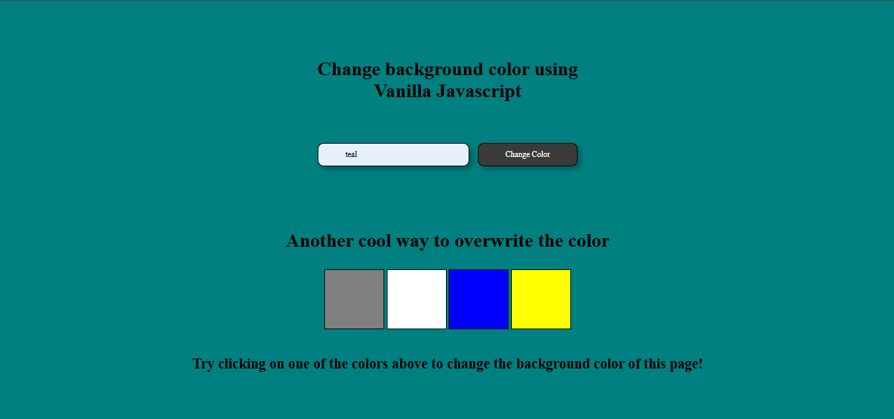

# 🎨 Background Color Changer

A simple and fun **Vanilla JavaScript project** that allows users to change the **background color** dynamically using input values or pre-defined color boxes.  
Part of my **6-month reskilling journey** to strengthen core JavaScript and DOM manipulation skills.

---

## 🖼️ Preview  

---

## 📌 About  
- ✨ Change page background by entering a color name or hex code  
- 🎯 Instantly switch background color by clicking color boxes  
- 🧠 Built using pure **HTML, CSS, and JavaScript**  
- 💡 Focused on **DOM manipulation**, **event handling**, and **user interactivity**

---

## 🧠 Tech Stack  
- **HTML5** – Structure  
- **CSS3** – Styling  
- **JavaScript (ES6)** – Functionality  

---